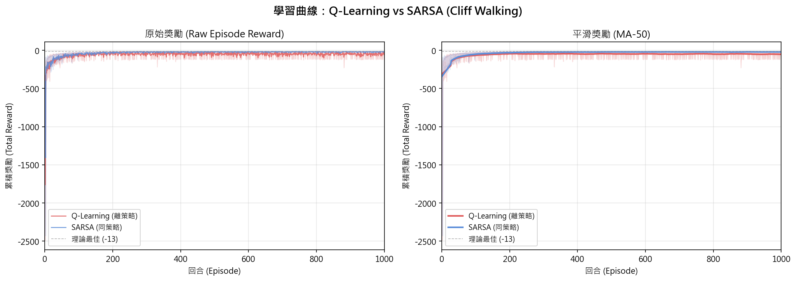
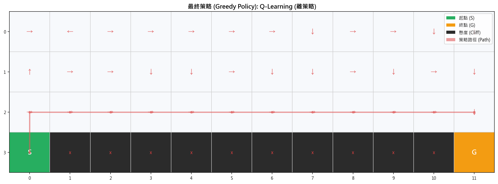
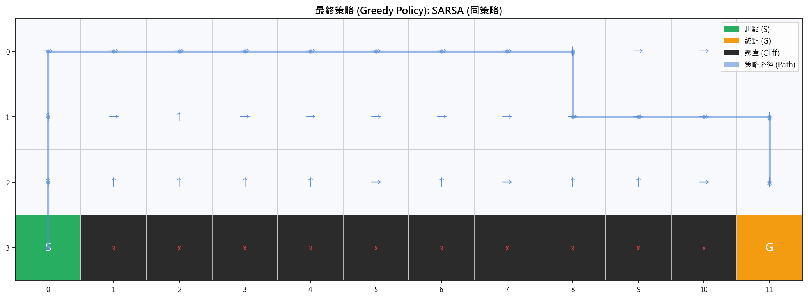
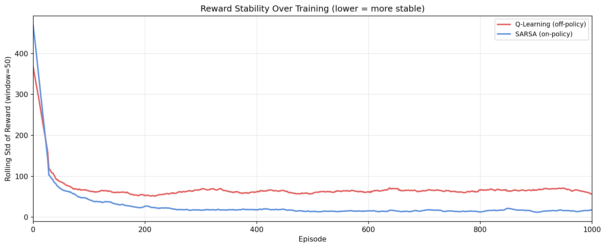
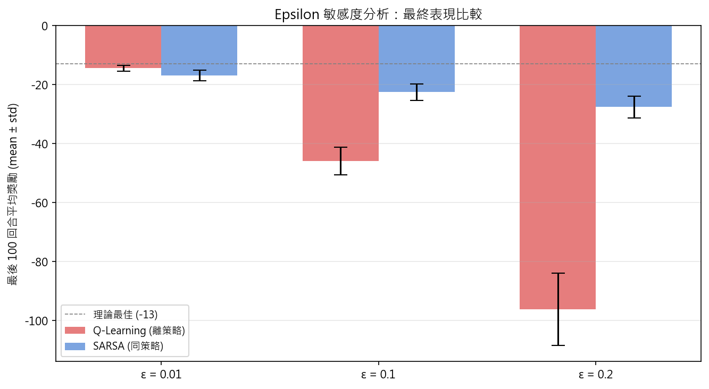

# 深度強化學習 HW2：Cliff Walking 實驗報告

## 一、作業目的
本作業旨在實作並比較兩種經典強化學習演算法——Q-learning 與 SARSA。透過相同環境與參數設定，分析其學習行為、收斂特性以及最終策略差異。

## 二、環境描述
本實驗採用經典的格子世界（Gridworld）問題，亦稱為「Cliff Walking」環境。環境設定如下：
- 使用一個矩形網格（$4 \times 12$）
- 起點（Start）位於左下角
- 終點（Goal）位於右下角
- 起點與終點之間的底部區域為「懸崖（Cliff）」

當代理（agent）進入懸崖時，會受到重大懲罰並回到起點。

## 三、問題設定
- **狀態空間（State Space）**：所有網格位置（共 48 個狀態）。
- **動作空間（Action Space）**：上、下、左、右。
- **獎勵機制（Reward）**：
  - 每移動一步：$-1$
  - 掉入懸崖：$-100$，並回到起點
  - 到達終點：回合結束
- **策略（Policy）**：$\epsilon$-greedy（本基礎實驗設定 $\epsilon = 0.1$）。
- **學習率（$\alpha$）**：$0.1$
- **折扣因子（$\gamma$）**：$0.9$
- **訓練回合數（Episodes）**：$1000$ 回合（符合至少 500 回合之要求，並以 20 次獨立隨機種子取平均，以確保數據客觀性）。

## 四、作業內容

### （一）演算法實作
本專案分別實作了以下兩種演算法，兩者皆建立並持續更新狀態-動作價值函數 $Q(s, a)$：
- **Q-learning（離策略方法，Off-policy）**：使用下一狀態的最大 Q 值來更新當前狀態的 Q 值。
- **SARSA（同策略方法，On-policy）**：使用下一狀態實際依據 $\epsilon$-greedy 採取的動作之 Q 值來更新。

### （二）訓練過程
在相同的環境與參數設定下，使用 $\epsilon$-greedy 策略進行訓練。為確保兩種方法的公平比較，實驗中我們使用相同的隨機種子（20 Seeds）獨立訓練兩種代理人各 1000 回合，以消除單一執行的隨機誤差。

### （三）結果分析

#### 1. 學習表現
- **繪製每一回合的累積獎勵（Total Reward）曲線**：
  
  *圖說：Q-learning 與 SARSA 在 1000 回合中的平滑累積獎勵（20 seeds 平均）。*

- **比較收斂速度**：
  
  實驗結果顯示，**SARSA 的收斂速度顯著快於 Q-Learning**。SARSA 約在 200 回合後即穩定上升並收斂在平均獎勵約 $-20$ 的水準；反觀 Q-Learning，在整個 1000 回合中都在 $-40$ 至 $-60$ 之間劇烈震盪，由於頻繁掉入懸崖，在給定的平滑閾值下遲遲未能達到穩定收斂。

#### 2. 策略行為
- **視覺化最終學習到的路徑**：
  **Q-Learning 最終貪婪策略**：
  
  **SARSA 最終貪婪策略**：
  
  *圖說：箭頭代表各狀態下 Q 值最大的動作，藍色虛線為從起點出發依貪婪策略行走之真實軌跡。*

- **分析是否傾向冒險或保守**：
  - **Q-learning 傾向冒險**：其學到的最終路徑緊貼著懸崖邊緣（最短路徑）。雖然理論上這是最佳解（只需 13 步），但在探索機制（$\epsilon=0.1$）下，只要有 $10\%$ 的機率隨機選擇動作，就極容易掉入懸崖。
  - **SARSA 傾向保守**：其學到的路徑遠離懸崖，選擇繞行網格的最上方。雖然路徑較長，但徹底避開了因探索而掉入懸崖的巨大風險。

#### 3. 穩定性分析
- **比較學習過程中的波動程度**：
  
  從波動程度圖可見，SARSA 在學習初期的波動迅速下降，並維持在極低的水準（跨種子的最終標準差約 2.37）。相反地，Q-learning 的波動程度始終居高不下（標準差達 6.56），表現極不穩定。

- **討論探索（exploration）對結果的影響**：
  $\epsilon$-greedy 的探索機制是造成兩者穩定性差異的主因。Q-learning 更新時不考慮探索風險（永遠樂觀假設未來會走最佳步），導致其在實際包含探索的訓練過程中不斷掉入懸崖承受 $-100$ 的懲罰。SARSA 則將探索的隨機性直接納入 Q 值的更新計算中，因此自然地學會了避開高風險區域。我們透過以下的 $\epsilon$ 敏感度分析圖也證實，當 $\epsilon$ 越高（探索越多），Q-learning 的表現退化越嚴重，而 SARSA 則能保持相對的穩定。
  

## 五、理論比較與討論
在報告中，我們說明以下概念：
- **Q-learning 為離策略（Off-policy）方法**，其更新基於「下一狀態的最佳可能行動」（$\max_a Q(s', a)$），即使該行動並未被實際執行。因此，Q-learning 傾向學習到理論上的最優策略（最短路徑），但在實際訓練過程中因為沒有將探索風險考慮進去，導致實際表現承受較高風險。
- **SARSA 為同策略（On-policy）方法**，其更新基於「實際採取的行動」（$Q(s', a')$），因此會反映探索策略的影響。這使得 SARSA 在學習過程中會主動考量到隨機掉下懸崖的風險，進而傾向學習到在實際探索策略下較安全、穩定的行為（繞遠路）。

## 六、結論要求
總結兩種方法在本實驗中的差異：
- **哪一種方法收斂較快**：**SARSA** 收斂較快。因為其價值估計包含了探索懲罰，能迅速將懸崖周邊標記為低價值並穩定在安全路徑上。
- **哪一種方法較穩定**：**SARSA** 較穩定。它學會了避開懸崖，因而在 $\epsilon$-greedy 執行下能持續獲得平穩的獎勵，回合間的波動極小。
- **在何種情境下應選擇 Q-learning 或 SARSA**：
  - **選擇 SARSA**：當「訓練階段的成本或安全性」非常重要時（例如實體機器人訓練、自駕車等不容許嚴重失誤的場景），或者系統在部署上線後仍需保持一定的探索率（持續學習）時，SARSA 是更好的選擇，因為它能保證過程的安全與穩定。
  - **選擇 Q-learning**：當訓練環境是低成本、絕對安全的模擬器，且最終部署時會將探索率關閉（$\epsilon=0$），純粹以完全貪婪（Greedy）的策略執行以追求極致的效能與最短路徑最佳解時，應選擇 Q-learning。
