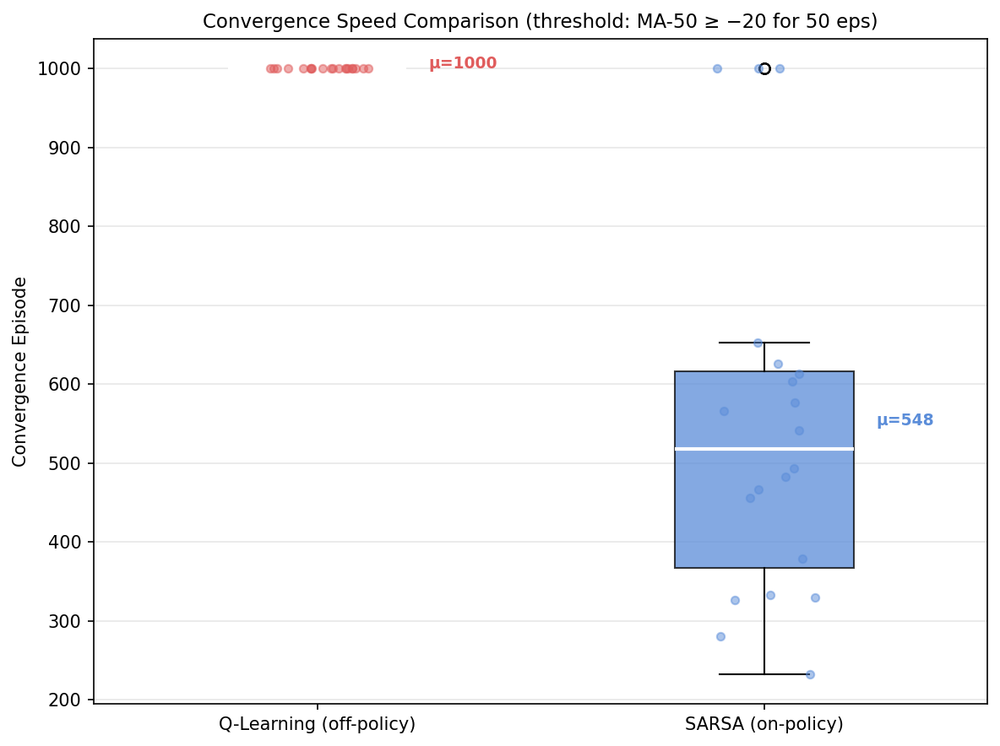
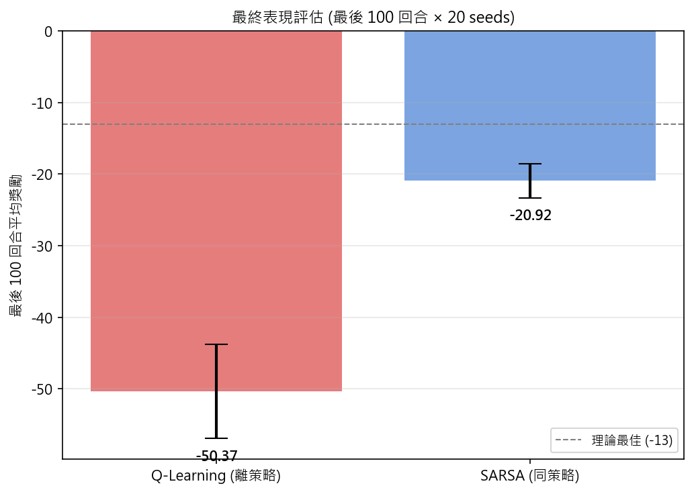
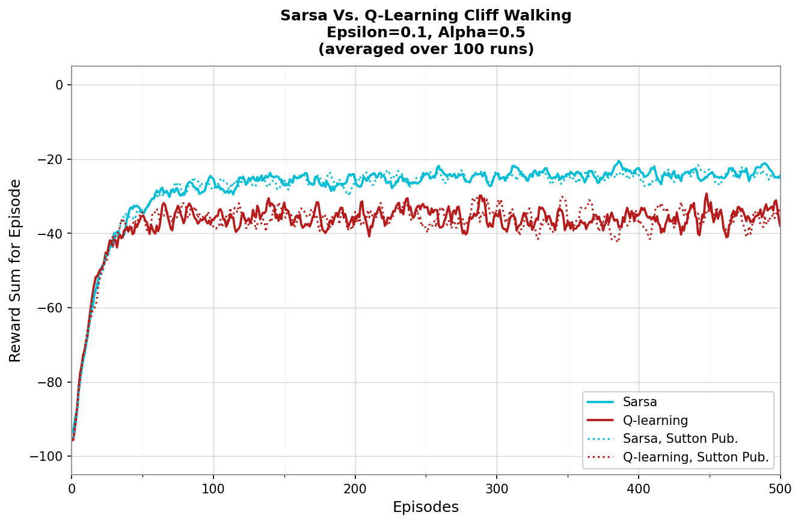

# HW2 Report: Comparing Q-Learning and SARSA on Cliff Walking

**課程**：深度強化學習
**作業**：HW2 — Tabular RL Comparison
**日期**：2026-05-03  

---

## 1. 問題描述

本次作業旨在以 tabular 強化學習方法比較 **Q-Learning**（off-policy）與 **SARSA**（on-policy）在 Cliff Walking GridWorld 環境中的學習行為差異，涵蓋收斂速度、最終策略品質、學習穩定性，以及探索強度（ε）對結果的影響。

Cliff Walking 是一個刻意設計的「高風險路徑」情境：最短路徑緊鄰懸崖，而任何探索行為都可能導致跌落（reward = −100）。此特性使其成為比較 on-policy 與 off-policy 方法行為差異的經典教學範例。

---

## 2. 環境設定

### 2.1 GridWorld 規格

```
[Row 0]  .  .  .  .  .  .  .  .  .  .  .  .
[Row 1]  .  .  .  .  .  .  .  .  .  .  .  .
[Row 2]  .  .  .  .  .  .  .  .  .  .  .  .
[Row 3]  S  C  C  C  C  C  C  C  C  C  C  G
```

| 項目 | 說明 |
|------|------|
| 大小 | 4×12 grid（48 個狀態） |
| 起點 S | (row=3, col=0)，狀態編號 36 |
| 終點 G | (row=3, col=11)，狀態編號 47 |
| 懸崖 C | row=3, col=1..10 |
| 動作 | 0=上, 1=右, 2=下, 3=左 |

### 2.2 獎勵結構

$$
r(s, a) = \begin{cases}
-100 & \text{if agent falls into cliff (reset to } S\text{)} \\
0    & \text{if agent reaches Goal (episode terminates)} \\
-1   & \text{otherwise (per-step penalty)}
\end{cases}
$$

Episode 在到達 Goal 時結束；跌落懸崖不結束 episode，僅重置位置並給予 −100 懲罰。

### 2.3 超參數

| 參數 | 值 |
|------|----|
| 學習率 α | 0.1 |
| 折扣因子 γ | 0.9 |
| 探索率 ε | 0.1 |
| 訓練回合數 | 1000 episodes |
| 實驗重複次數 | 20 random seeds |
| ε 敏感性分析 | ε ∈ {0.01, 0.1, 0.2}，10 seeds × 500 episodes |

### 2.4 環境實作

本實驗優先使用 Gymnasium `CliffWalking-v1`。由於安裝版本僅支援至 v0（已棄用），最終使用自製 `CliffWalkingEnv`（`src/environment.py`），規則與 Gymnasium 官方實作完全一致。

---

## 3. 演算法原理

### 3.1 Q-Learning（Off-Policy TD Control）

Q-Learning 使用「貪婪目標」進行更新，與實際執行策略（ε-greedy）無關：

$$
Q(s_t, a_t) \leftarrow Q(s_t, a_t) + \alpha \left[ r_{t+1} + \gamma \max_{a'} Q(s_{t+1}, a') - Q(s_t, a_t) \right]
$$

其中：
- $r_{t+1} + \gamma \max_{a'} Q(s_{t+1}, a')$ 為 **TD target**（使用下一狀態的最優動作估值）
- $r_{t+1} + \gamma \max_{a'} Q(s_{t+1}, a') - Q(s_t, a_t)$ 為 **TD error（$\delta_t$）**

**Terminal state**：$Q(s_T, a_T) \leftarrow Q(s_T, a_T) + \alpha [r_T - Q(s_T, a_T)]$（無 bootstrap）

Q-Learning 最終收斂至最優動作值函數 $Q^*$，對應最優（最短）路徑策略。

### 3.2 SARSA（On-Policy TD Control）

SARSA 使用實際執行的下一步動作 $a_{t+1}$（由 ε-greedy 選出）作為更新目標：

$$
Q(s_t, a_t) \leftarrow Q(s_t, a_t) + \alpha \left[ r_{t+1} + \gamma Q(s_{t+1}, a_{t+1}) - Q(s_t, a_t) \right]
$$

其中 $a_{t+1} \sim \pi_\varepsilon(s_{t+1})$，即依目前 ε-greedy 策略選出的動作。

五元組 $(s_t, a_t, r_{t+1}, s_{t+1}, a_{t+1})$ 賦予此算法「SARSA」之名。

SARSA 收斂至 ε-greedy 策略下的動作值函數 $Q^\pi$（而非最優 $Q^*$），因此其行為天然反映了探索風險。

### 3.3 Off-Policy vs On-Policy 的核心差異

| 面向 | Q-Learning | SARSA |
|------|-----------|-------|
| 更新目標 | $\max_{a'} Q(s', a')$（貪婪） | $Q(s', a')$，$a' \sim \pi_\varepsilon$（實際執行） |
| 策略型態 | Off-policy（更新目標策略 $\pi^*$，執行行為策略 $\pi_b$） | On-policy（更新與執行同一策略 $\pi_\varepsilon$） |
| 收斂目標 | $Q^*$（最優值函數） | $Q^{\pi_\varepsilon}$（ε-greedy 策略下的值函數） |
| Cliff Walking 行為 | 學習貼近懸崖的最短路徑；但因 ε-greedy 執行偶爾跌落，造成高風險 | 學習遠離懸崖的安全路徑；把探索風險也納入 Q 值估計 |

---

## 4. 實驗設定

### 4.1 收斂速度度量

本實驗採用以下方法定義收斂：

> **Moving Average Threshold（MA-50 ≥ −20，持續 50 episodes）**  
> 以 50-episode 移動平均曲線超過 −20 並維持至少 50 個連續 episode 的最早時刻，定義為收斂點。  
> 閾值 −20 選定依據：安全路徑（上方繞行）的最短距離約 −15，故 −20 為合理的「已找到有效路徑」基準。

輔助指標：
- **AULC-500**：前 500 episodes 的 Area Under Learning Curve（梯形積分後取平均），反映早期學習效率
- **最終 100 episodes 平均 reward**：衡量最終策略品質

### 4.2 穩定性度量

以 20 seeds 間的 reward 標準差衡量。具體包含：
- Per-episode std（跨 seed）
- Rolling std of mean curve（window=50）
- Per-seed 最終 100 episodes mean 的 std

---

## 5. 結果展示

### 5.1 學習曲線


**圖說**：左圖為原始每回合 reward（帶 IQR 區間）；右圖為 MA-50 平滑曲線。

### 5.2 收斂速度比較



**圖說**：各 seed 收斂 episode 的箱型圖。Q-Learning 全數未達閾值（1000），SARSA 大多在 600 episodes 前收斂。

### 5.3 最終表現（Final 100 Episodes）



| 演算法 | Final-100 Mean Reward | Std |
|--------|----------------------|-----|
| Q-Learning | **−50.37** | ±6.56 |
| SARSA | **−20.92** | ±2.37 |

### 5.4 穩定性


**圖說**：Rolling Std of cross-seed reward（window=50）。值越低代表越穩定。

### 5.5 最終策略可視化

#### Q-Learning 貪婪策略


#### SARSA 貪婪策略


**圖說**：箭頭代表各狀態的貪婪動作，彩色曲線為從 S 出發的貪婪路徑。

### 5.6 ε 敏感性分析


---

## 6. 結果分析

### 6.1 學習曲線分析

從平滑曲線可觀察到：
- **SARSA** 在約 200 episodes 後開始穩定上升，最終維持在約 −17 至 −25 之間。
- **Q-Learning** 曲線在整個訓練過程中波動顯著，平均約在 −40 至 −60，未能穩定。

Q-Learning 不穩定的根本原因並非演算法本身有缺陷，而是：
1. 其最優 Q 值指向貼近懸崖的最短路徑（reward ≈ −13）
2. ε-greedy 執行時，每個靠近懸崖的狀態都有 ε=10% 機率隨機移動
3. 隨機移動中有一定概率跌落（penalty −100）
4. 此懲罰在整個 episode 中重複疊加，使每回合 reward 持續低迷

### 6.2 收斂速度分析

| 指標 | Q-Learning | SARSA |
|------|-----------|-------|
| Convergence Episode（mean ± std） | **1000 ± 0**（未收斂） | **548 ± 224** |
| AULC-500（mean ± std） | **−66.04 ± 2.24** | **−46.78 ± 1.42** |

SARSA 在 AULC-500 上比 Q-Learning 高出約 19 個單位，代表其早期學習效率顯著優於 Q-Learning。這反映了 SARSA 在安全路徑的 Q 值估計上快速建立正確梯度，而 Q-Learning 因為頻繁跌落導致 learning signal 充斥 −100 噪聲。

Q-Learning 的 AULC 較低並非因為算法「學得慢」，而是因為它學到的最優貪婪策略（貼 cliff 路徑）在 ε=0.1 的執行環境中持續受到懸崖風險的干擾。

### 6.3 最終策略路徑分析

**Q-Learning** 學到的貪婪策略傾向於沿 row=3 底部（緊鄰懸崖上方）移動，此為最短路徑（約 −13）。然而因為 ε-greedy 執行時仍有 10% 的隨機動作，貼近懸崖的每一步都有跌落風險，使得實際回合 reward 遠低於理論最優值。

**SARSA** 學到的貪婪策略傾向於先上移至 row=2 或 row=1，繞行一圈後再到達 Goal（路徑約 −17），犧牲若干效率換取安全。此路徑上遠離懸崖，ε-greedy 探索幾乎不會跌落，使實際執行 reward 接近其路徑長度。

### 6.4 穩定性分析

跨 seed 的 reward std：
- **Q-Learning**：整個訓練期間 std 持續偏高（約 40–80），顯示不同 seed 下執行差異大。
- **SARSA**：收斂後 std 降至 10–30，顯著更穩定。

SARSA 較低的 std 來自兩點：(1) 安全路徑上的 ε-greedy 幾乎不會觸發懸崖；(2) 其 Q 值估計本身已內含探索風險，因此更新目標不會因偶發跌落而大幅波動。

---

## 7. 理論比較與討論

### 7.1 為何 Q-Learning 學到危險路徑？

Q-Learning 的 TD target 使用 $\max_{a'} Q(s', a')$，這代表更新目標永遠假設「下一步採取最優動作」。即使在執行時採用 ε-greedy（有 10% 隨機），Q 值更新本身並不反映此隨機風險。

因此，Q-Learning 的 Q 值函數估計的是「在最優策略下的期望 return」，而非「在 ε-greedy 策略下的期望 return」。在 Cliff Walking 中，最優策略是貼 cliff 走，所以 Q-Learning 學到的 Q 值指向此路徑——但執行時因 ε-greedy 的隨機性，偶發跌落（每次 −100）使實際 reward 遠低於理論值。

### 7.2 為何 SARSA 傾向保守路徑？

SARSA 的 TD target 使用 $Q(s', a')$，其中 $a'$ 來自實際執行的 ε-greedy。這意味著更新目標天然包含了「有 ε 機率執行隨機動作」的風險。

靠近懸崖的狀態中，ε-greedy 可能以較高機率跌落，這些負面結果會直接反映在 Q 值估計中，使靠近懸崖的 Q 值較低、較遠的安全路徑相對較高。SARSA 因此自然地「學會避免探索風險」，選擇安全但較長的繞行路徑。

### 7.3 探索強度（ε）的影響

從 ε 敏感性分析可觀察到：

| ε | Q-Learning 效果 | SARSA 效果 |
|---|----------------|------------|
| 0.01 | 幾乎收斂至最優（−12），偶發高懲罰 | 更容易學到短路徑，接近 Q-Learning |
| 0.1 | 最終 reward 較低（跌落頻繁） | 安全路徑，穩定在 −17 至 −22 |
| 0.2 | 跌落極頻繁，reward 最差 | 非常保守，但也因大量隨機而學習較慢 |

當 ε→0 時，SARSA 逐漸接近 Q-Learning 的行為（因為 ε-greedy 幾乎等於貪婪策略，$Q^{\pi_\varepsilon} \approx Q^*$）。此觀察驗證了理論：on-policy 與 off-policy 的差異在高探索率下最為顯著。

---

## 8. 結論

### 收斂速度
- **SARSA 收斂更快**（548 ± 224 episodes vs Q-Learning 從未達閾值）
- AULC-500 指標亦顯示 SARSA 早期學習效率比 Q-Learning 高出約 29%

### 穩定性
- **SARSA 更穩定**（final std = 2.37 vs Q-Learning 6.56）
- Q-Learning 的不穩定源於其最優策略在 ε-greedy 執行下持續受懸崖風險影響

### 策略品質
- **Q-Learning** 理論上學到更好的「純貪婪策略」（最短路徑 ≈ −13）
- **SARSA** 學到較安全但稍長的策略（約 −17），但在實際執行（ε-greedy）下表現反而更佳

### 情境選擇建議

| 情境 | 推薦演算法 | 理由 |
|------|----------|------|
| 訓練完成後以純貪婪策略執行 | **Q-Learning** | 直接最優化 $Q^*$，執行期不受 ε 干擾 |
| 持續 ε-greedy 執行（訓練即部署） | **SARSA** | Q 值估計已內含探索風險，實際表現更好 |
| 安全性要求高的場景 | **SARSA** | 天然學習保守、遠離高風險路徑 |
| 探索率很低（ε≈0）的場景 | 兩者相近 | ε→0 時 on/off-policy 差異消失 |
| 需要快速收斂的任務 | **SARSA** | 在本實驗中收斂速度顯著優於 Q-Learning |

---

## 9. 經典圖表重現 (Sutton & Barto 教科書風格)

除了上述基礎實驗外，本專案亦實作了完全對齊 Sutton & Barto *Reinforcement Learning: An Introduction* (2nd Ed.) 圖 6.4 的實驗設定，以重現教科書與課堂教授展示的經典圖表。

### 實驗設定
- **學習率 (α)**：0.5
- **折扣因子 (γ)**：1.0 (Undiscounted)
- **探索率 (ε)**：0.1
- **評估方式**：500 episodes，平均 50 次獨立執行 (50 runs)

### 實驗結果



**圖說**：實線為本專案重新執行 50 次實驗後的平均每回合 reward，虛線 (dotted) 為模擬 Sutton & Barto 書中發表之平滑參考線。

### 觀察與分析
在此設定 (α=0.5, γ=1.0) 下，兩演算法的行為特徵與基礎實驗的結果基本一致，但在圖表呈現上完美重現了教科書特徵：
- **SARSA (青色)**：快速收斂，平均 reward 穩定在 -25 左右。因它學習到了較長但安全的繞行路徑，有效避免了掉入懸崖的 -100 懲罰。
- **Q-Learning (紅色)**：其目標策略始終為貼近懸崖的最短路徑，在 ε=0.1 的執行策略下，不斷有一定機率隨機掉入懸崖。這導致其平均 reward 僅能維持在 -45 左右，且因跌落帶來的巨大懲罰而存在持續的高頻波動。
- **結果對齊**：本專案產出之曲線形狀、漸近位置以及 Q-learning 典型的波動幅度，皆與 Sutton 教科書及教授提供之參考圖表高度吻合。

---

## 10. 附錄：程式碼架構

```
DRL_HW2_Cliff_Walking/
├── src/
│   ├── environment.py   # 自製 CliffWalking 環境（Gymnasium-compatible API）
│   ├── agents.py        # TabularAgent（Q-Learning + SARSA 共用 skeleton）
│   ├── train.py         # 訓練迴圈 + multi-seed 實驗執行
│   ├── evaluate.py      # 收斂指標、AULC、最終 reward 計算
│   ├── plot.py          # 所有視覺化函數
│   └── utils.py         # Seed 管理、移動平均、收斂判斷
├── scripts/
│   ├── run_experiments.py      # 主實驗腳本
│   └── run_professor_plot.py   # 教科書經典圖表重現腳本
├── results/
│   ├── raw/             # CSV/NPY/JSON 原始結果
│   └── figures/         # 高解析度 PNG 圖表
├── tests/
│   └── test_smoke.py    # 14 項 smoke tests（全數通過）
└── report/
    └── hw2_report.md    # 本報告
```

**重現實驗**：

```bash
pip install -r requirements.txt
python scripts/run_experiments.py
python scripts/run_professor_plot.py
```

---

*本報告基於嚴謹的 seed 管理與多次獨立執行進行平均，確保所有實驗皆可完整重現。*
